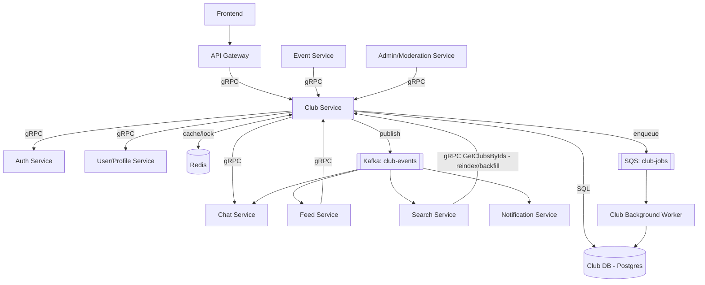

# StudHub — Club Service Architecture Document

## 1. Purpose & Scope

The Club Service is the source of truth for **Club**, **ClubMember**, **ClubCategory**, and **ClubJoinRequest** data within StudHub. It owns club lifecycle (creation, approval, archival), membership management, and club discovery (search, trending, featured).

Because club membership is referenced by nearly every other domain in StudHub (events, feed, chat, notifications), this service is a high-fan-out dependency and is designed accordingly: read-heavy paths are cache-first, and cross-service side effects are event-driven rather than synchronous wherever possible.

---

## 2. Repository Structure

```
club-service/
├── cmd/
│   └── server/
│       └── main.go                 // service bootstrap: config, DB, gRPC server, Kafka/SQS clients
├── internal/
│   ├── config/
│   │   └── config.go                // env vars: DB DSN, Redis URL, Kafka brokers, SQS queue URLs
│   ├── domain/
│   │   ├── club.go                  // Club struct + status/type enums
│   │   ├── club_member.go
│   │   ├── club_category.go
│   │   └── join_request.go
│   ├── repository/
│   │   ├── club_repo.go             // interface
│   │   ├── member_repo.go
│   │   ├── category_repo.go
│   │   └── postgres/
│   │       ├── club_repo_pg.go
│   │       └── member_repo_pg.go
│   ├── service/
│   │   ├── club_service.go          // business logic, orchestrates repo + cache + events
│   │   ├── member_service.go
│   │   └── order_service.go         // reorder/sort logic, Redis lock usage
│   ├── grpc/
│   │   ├── server.go                 // implements the generated ClubServiceServer interface
│   │   └── interceptors.go           // auth, logging, tracing interceptors
│   ├── clients/                       // gRPC clients TO downstream services
│   │   ├── auth_client.go
│   │   ├── user_client.go
│   │   └── chat_client.go
│   ├── events/
│   │   ├── kafka_producer.go         // publishes club-events
│   │   └── outbox.go                  // transactional outbox writer + relay
│   ├── jobs/
│   │   ├── sqs_enqueuer.go
│   │   └── sqs_worker.go              // separate binary/deployment target
│   ├── cache/
│   │   └── redis_client.go            // membership cache, trending cache, locks
│   └── middleware/
│       └── logging.go
├── pb/                                 // generated code from club.proto (protoc/buf output)
│   ├── club.pb.go
│   └── club_grpc.pb.go
├── proto/
│   └── club.proto
├── migrations/
│   └── 0001_create_clubs.sql
├── tests/
│   ├── club_service_test.go
│   └── member_service_test.go
├── go.mod
├── go.sum
└── Dockerfile
```

**Notes:**
- `internal/clients/` (downstream gRPC clients) and `internal/grpc/` (this service's own gRPC server) are kept separate — one is "calls I make", the other is "calls I receive."
- `internal/events/outbox.go` + a DB `outbox` table are what make Kafka publishing transactionally safe with the Postgres write (§4 of doc).
- The SQS worker (`internal/jobs/sqs_worker.go`) is typically compiled into its **own binary** (`cmd/worker/main.go`) so it can be deployed and scaled independently of the gRPC server — a burst of bulk member imports shouldn't compete for resources with live `ValidateClubMembership` traffic.

---

## 3. Proto Structure

```
proto/
└── club.proto          // single file is fine at this size; split by domain if it grows:
                         //   club/v1/club.proto        (Club CRUD messages + service)
                         //   club/v1/member.proto      (membership messages)
                         //   club/v1/category.proto    (category messages)
```

**Within `club.proto`, the convention followed:**

1. `syntax`, `package`, `option go_package` — always first.
2. **Enums** — `ClubStatus`, `ClubType`, `MemberRole`, `MemberStatus`, `JoinRequestStatus`. Every enum's zero value is `*_UNSPECIFIED` (proto3 best practice — never let zero silently mean something like "pending").
3. **Core domain messages** — `Club`, `ClubMember`, `ClubCategory`, `ClubJoinRequest` — mirror the domain models 1:1 so mapping between Go structs and proto messages stays mechanical.
4. **Request/Response messages** — one pair per RPC, named `<Rpc>Request` / `<Rpc>Response`. Even RPCs that logically return "nothing" use `google.protobuf.Empty` rather than an empty custom message, to avoid proto bloat.
5. **Service definition last** — the `service ClubService { ... }` block, grouped by: Club CRUD → Membership → hot-path validation.

**Versioning convention:** package is `club.v1`. A breaking change (removing/renaming a field, changing a type) means introducing `club.v2` as a new package/directory rather than mutating `v1`, so existing consumers on `v1` don't break mid-rollout.

See `club.proto` (delivered alongside this document) for the full definition.

---

## 4. Service Dependency Map

### 2.1 Upstream (services that call Club Service)

| Caller | Reason | Interface |
|---|---|---|
| API Gateway | Routes all club-related frontend traffic | gRPC — full CRUD + membership surface |
| Event Service | Validates a club exists/is active before registering it for a global event; pulls member roster to register participants | gRPC — `GetClub`, `ListMembers`, `ValidateClubMembership` |
| Feed Service | Confirms a poster is a member before allowing a club-scoped post/comment | gRPC — `ValidateClubMembership` |
| Admin/Moderation Service | Fetches club details, deactivates a club, inspects members during a report review | gRPC — `GetClub`, `UpdateClubStatus`, `ListMembers` |
| Notification Service | Pulls member list for club-wide announcements (pull path only; push path is event-driven, see §4) | gRPC — `ListMembers` (batch) |
| Search Service | Owns the searchable club index; consumes Kafka events for incremental updates (§6), but calls back into Club Service for full reindex/backfill jobs or to fetch full club detail when a search result is clicked through | gRPC — `GetClub`, `GetClubsByIds` (batch, used during reindex) |

### 2.2 Downstream (services Club Service calls)

| Callee | Reason | Interface |
|---|---|---|
| Auth Service | Verify elevated-permission claims (college-admin, club-admin) for privileged actions | gRPC — `VerifyPermission` / `GetUserRoles` |
| User/Profile Service | Enrich member lists with display name/avatar; confirm a user's college for scoping global clubs | gRPC — `GetUserProfile`, `GetUsersByIds` (batch) |
| Chat Service | Provision the club's common channel on approval; keep channel membership in sync | gRPC — `CreateChannel`, `AddChannelMember`, `RemoveChannelMember` |

**Note:** Chat, Notification, and Feed do *not* receive synchronous calls from Club Service for membership changes — those go through Kafka (§4) to keep Club Service decoupled from their availability.

---

## 5. Communication Strategy — When to Use What

| Mechanism | Use when | Example in Club Service |
|---|---|---|
| **gRPC (sync)** | Caller needs an immediate answer to proceed | `ValidateClubMembership` called by Feed Service before accepting a post |
| **Kafka (async, fan-out)** | Something happened; multiple decoupled services must react | `club.member.joined` → Chat, Notification, Analytics all react independently |
| **SQS (async, point-to-point)** | One service must reliably do background work with retries/DLQ; no fan-out needed | Bulk CSV member import, image thumbnail generation |
| **Redis** | Hot-path caching, rate limiting, distributed locks | Membership check cache, reorder lock, trending list |

---

## 6. Kafka — Domain Events (topic: `club-events`)

| Event | Payload | Consumers |
|---|---|---|
| `club.created` | clubId, name, category, collegeId, createdBy | Admin/Moderation (audit), Search Service |
| `club.approved` | clubId | Chat Service (create channel), Notification Service |
| `club.updated` | clubId, diff | Search Service (re-indexes) |
| `club.deleted` / `club.archived` | clubId | Chat (archive channel), Feed (hide club feed), Search Service (removes from index) |
| `club.member.joined` | clubId, userId | Chat (add to channel), Notification, Analytics |
| `club.member.left` / `club.member.removed` | clubId, userId | Chat (remove from channel), Notification |
| `club.member.role_changed` | clubId, userId, newRole | Chat (update channel perms), Notification |
| `club.featured.updated` | clubId, isFeatured | Feed (surface on home feed), Search Service (boosts in ranking) |

**Delivery guarantee:** at-least-once. Consumers must dedupe by `eventId` (included in every payload).

**Reliability pattern:** Transactional Outbox — the DB write (e.g. insert into `clubs`) and the outbox row for the Kafka event are committed in the same transaction. A relay process (Debezium CDC or a polling publisher) reads the outbox and publishes to Kafka, guaranteeing no event is lost even if the broker is briefly unavailable.

---

## 7. SQS — Background Jobs (queue: `club-jobs`)

| Job | Trigger | Notes |
|---|---|---|
| Banner/logo image processing | Club create/update with new image | Resize, compress, generate thumbnails |
| Bulk member import | Club admin uploads CSV | Row-by-row processing with per-row retry; failures reported back to admin |
| Nightly analytics rollup | Scheduled | Member growth, engagement stats per club |
| Sort-order / member-count reconciliation | Scheduled or triggered on detected drift | Fixes denormalized fields without blocking request path |

SQS is chosen over Kafka here because these are "do this task once, retry, DLQ on failure" jobs — not facts other services need to know about.

---

## 8. Redis — Caching & Coordination

| Key pattern | Purpose | TTL / Type |
|---|---|---|
| `club:{clubId}` | Cached club detail | JSON, TTL ~5 min, invalidated on `club.updated`/`club.deleted` |
| `clubs:trending:{collegeId}` | Trending/featured listing | Sorted set, TTL 1–2 min |
| `club:{clubId}:members` | Fast membership lookup | Redis Set, `SISMEMBER` for `ValidateClubMembership` |
| `ratelimit:join:{userId}` | Prevent join/leave spam | `INCR` + `EXPIRE` |
| `lock:club-reorder:{collegeId}` | Prevent concurrent reorder corruption | Redlock, short TTL |

Member count and club data remain authoritative in Postgres; Redis is cache-through, never source of truth.

---

## 9. gRPC Surface (see `club.proto`)

Key design choices:
- `ValidateClubMembership` and `GetClubsByIds` are first-class, separately optimized (Redis-first) RPCs since they're the highest-volume calls from other services.
- All mutating RPCs are idempotent where possible (e.g. `JoinClub` is a no-op if already a member, not an error).

---

## 10. Architecture Diagram



---

## 11. Production Hardening Checklist

- **Idempotency**: unique constraint on `(club_id, user_id)` for membership; retried `JoinClub`/`LeaveClub` calls never double-count.
- **Circuit breakers**: wrap Auth/User/Chat gRPC clients (e.g. `sony/gobreaker`); Chat Service downtime should not block club creation — queue the channel-creation side effect and retry via the outbox/Kafka path instead of failing the request.
- **Transactional outbox**: DB write + event emission happen atomically.
- **Consumer idempotency**: downstream services dedupe Kafka events by `eventId` (at-least-once delivery).
- **Observability**: OpenTelemetry tracing across Gateway → Club Service → downstream gRPC calls; structured logging with request/correlation IDs.
- **College scoping**: every query filtered by `collegeId` at the repository layer (not just handler layer) except for explicitly global clubs — prevents cross-college data leakage from a handler bug.
- **Rate limiting**: join/leave endpoints protected against spam via Redis counters.
- **Graceful degradation**: if Redis is unavailable, `ValidateClubMembership` falls back to Postgres rather than failing closed.
